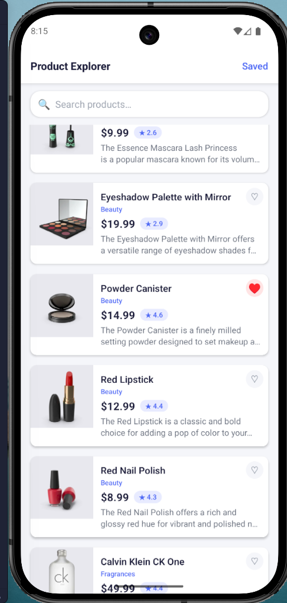
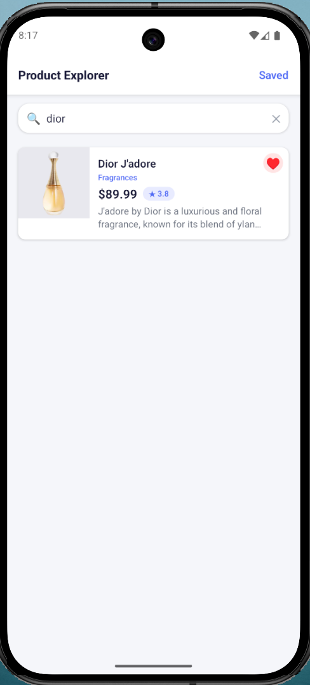
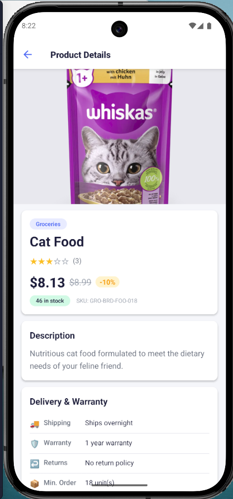
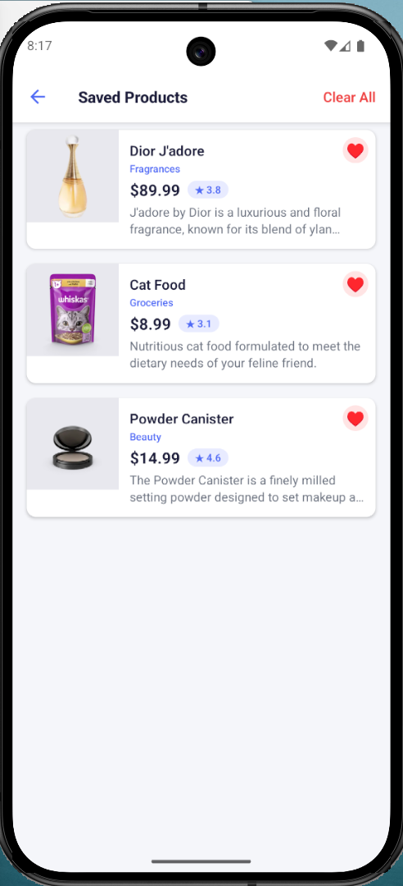

# ProductExplorer

<p align="center">
  <strong>A polished React Native product browsing app built for smooth discovery, fast search, and reliable local saving.</strong>
</p>

<p align="center">
  ProductExplorer connects to the DummyJSON API and turns a simple catalog into a clean mobile experience. It focuses on the essentials that make browsing feel good in practice: responsive search, infinite loading, persistent saved items, and clear detail views.
</p>

<p align="center">
  <a href="#overview">Overview</a> |
  <a href="#highlights">Highlights</a> |
  <a href="#tech-stack">Tech Stack</a> |
  <a href="#project-structure">Project Structure</a> |
  <a href="#getting-started">Getting Started</a> |
  <a href="#screens">Screens</a>
</p>

<p align="center">
  
  
  
  
</p>

---

## Overview

ProductExplorer is a mobile-first catalog app for browsing products, searching across listings, opening rich detail pages, and saving favorites locally for later. The project is structured like a production-ready React Native application, with clear separation between API calls, state management, navigation, reusable components, and screen-level logic.

### Built To Demonstrate

- Clean product listing with paginated loading
- Debounced search for faster and more stable queries
- Persistent saved products using local storage
- Smooth navigation between list, details, and saved items
- Resilient UI states for loading, empty results, and errors

## Highlights

| Section | Details |
| --- | --- |
| `Browse` | Infinite scrolling product feed backed by DummyJSON pagination |
| `Search` | Debounced query handling to reduce noisy requests |
| `Details` | Product pricing, ratings, metadata, and focused item presentation |
| `Save` | Save and unsave items from multiple screens with persisted state |
| `Refresh` | Pull-to-refresh support for quick data reloads |
| `Stability` | Error handling and empty-state coverage across the UI |

## Tech Stack

| Layer | Package / Tool | Version |
| --- | --- | --- |
| Runtime | Node.js | `>= 22.11.0` |
| Framework | `react-native` | `0.84.1` |
| UI | `react` | `19.2.3` |
| Language | `typescript` | `^5.8.3` |
| State | `@reduxjs/toolkit` | `^2.6.1` |
| State | `react-redux` | `^9.2.0` |
| Persistence | `redux-persist` | `^6.0.0` |
| Storage | `@react-native-async-storage/async-storage` | `^2.1.2` |
| Navigation | `@react-navigation/native` | `^7.1.6` |
| Navigation | `@react-navigation/native-stack` | `^7.3.10` |
| Android | `minSdkVersion` | `24` |
| Android | `compileSdkVersion` | `36` |
| Android | `targetSdkVersion` | `36` |
| Android | `buildToolsVersion` | `36.0.0` |
| Android | Kotlin | `2.1.20` |
| Android | Gradle Wrapper | `9.0.0` |
| iOS | Deployment target | Managed by `min_ios_version_supported` in Podfile |

## Project Structure

```text
src/
  api/           API service layer
  components/    Reusable UI building blocks
  hooks/         Custom React hooks
  navigation/    Navigation setup and stacks
  redux/         Store, slices, and persisted state
  screens/       Screen-level views
  types/         Shared TypeScript types
  utils/         Theme values and helper utilities
```

## Getting Started

### 1. Install dependencies

```bash
npm install
```

### 2. Install iOS pods (macOS only)

```bash
bundle install
bundle exec pod install --project-directory=ios
```

### 3. Configure Android SDK on Windows

If Android builds fail because the SDK path is missing, create `android/local.properties`:

```properties
sdk.dir=C:\\Users\\<YourUser>\\AppData\\Local\\Android\\Sdk
```

If `adb` or `emulator` is not recognized, add these folders to your `PATH`:

- `%LOCALAPPDATA%\Android\Sdk\platform-tools`
- `%LOCALAPPDATA%\Android\Sdk\emulator`

## Run The App

### Start Metro

```bash
npm start
```

### Run on Android

```bash
npm run android
```

### Run on iOS

```bash
npm run ios
```

## Available Scripts

| Script | Command | Purpose |
| --- | --- | --- |
| Start Metro | `npm start` | Start the React Native bundler |
| Run Android | `npm run android` | Build and launch the Android app |
| Run iOS | `npm run ios` | Build and launch the iOS app |
| Lint | `npm run lint` | Run ESLint |
| Test | `npm test` | Run Jest |

## API Reference

Base URL: `https://dummyjson.com`

| Endpoint | Purpose |
| --- | --- |
| `GET /products?limit=&skip=` | Browse products with pagination |
| `GET /products/search?q=&limit=&skip=` | Search products with pagination |
| `GET /products/{id}` | Fetch a single product detail |

## Screens

<table>
  <tr>
    <td align="center" width="50%">
      <strong>Product List</strong><br/>
      
    </td>
    <td align="center" width="50%">
      <strong>Search Results</strong><br/>
      
    </td>
  </tr>
  <tr>
    <td align="center" width="50%">
      <strong>Product Details</strong><br/>
      
    </td>
    <td align="center" width="50%">
      <strong>Saved Products</strong><br/>
      
    </td>
  </tr>
</table>

Add future screenshots in `docs/screenshots/` and keep the same naming pattern for consistency.

## Notes

- Saved products are persisted locally with Redux Persist and AsyncStorage.
- The architecture is flexible enough to swap DummyJSON for another backend later.
- The current setup is well-suited for extending into filters, sorting, authentication, or cart flows.
